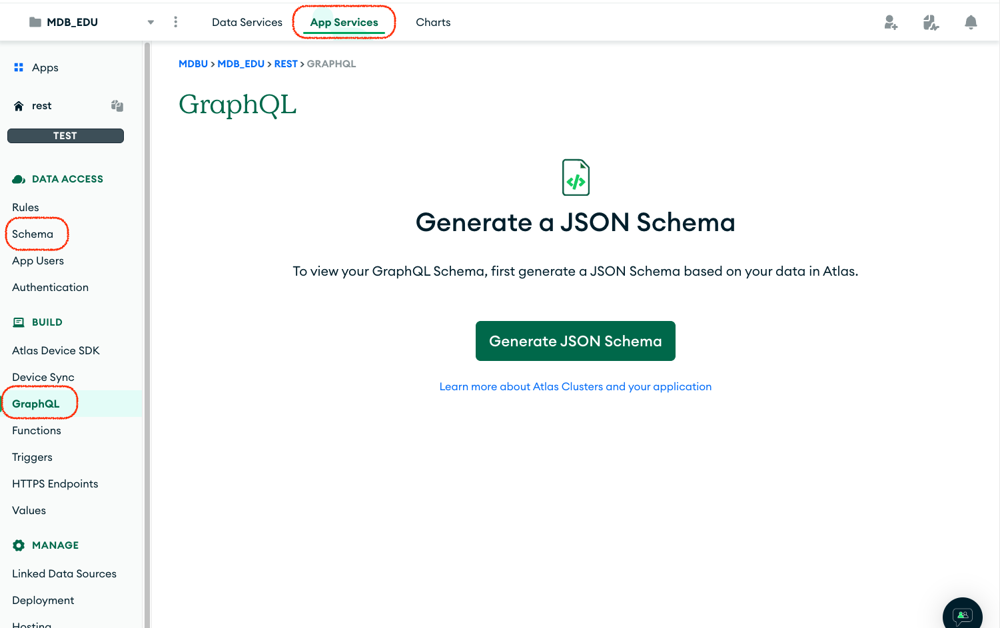
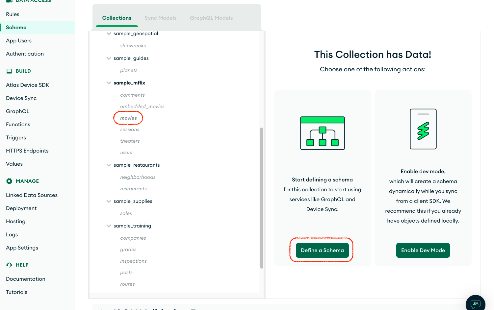
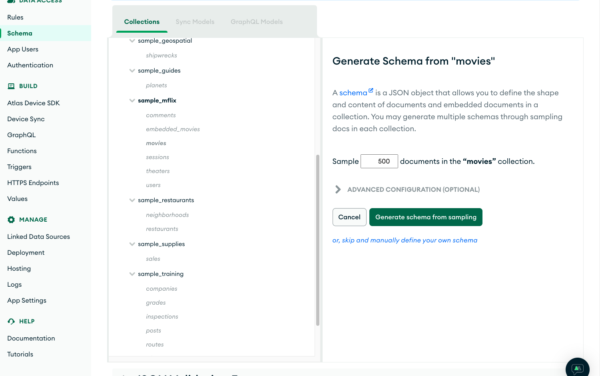
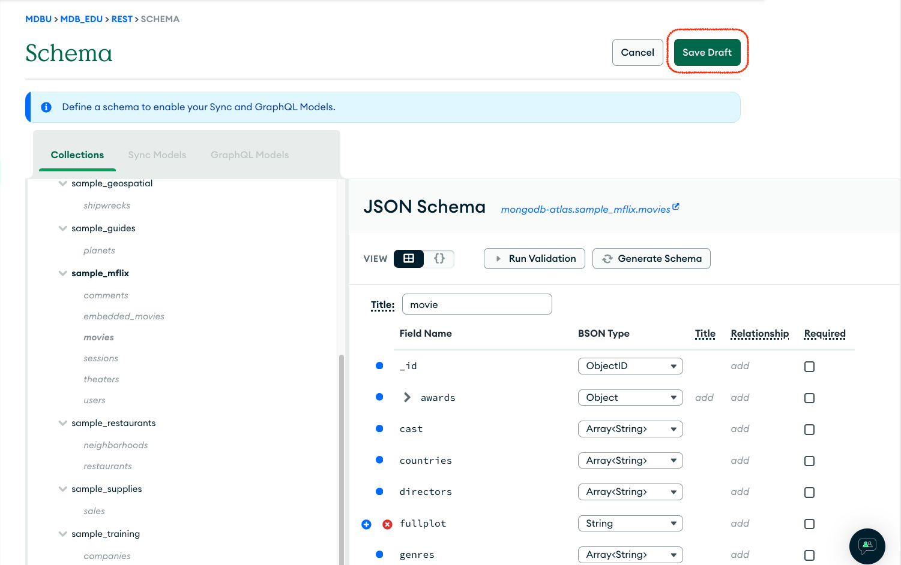
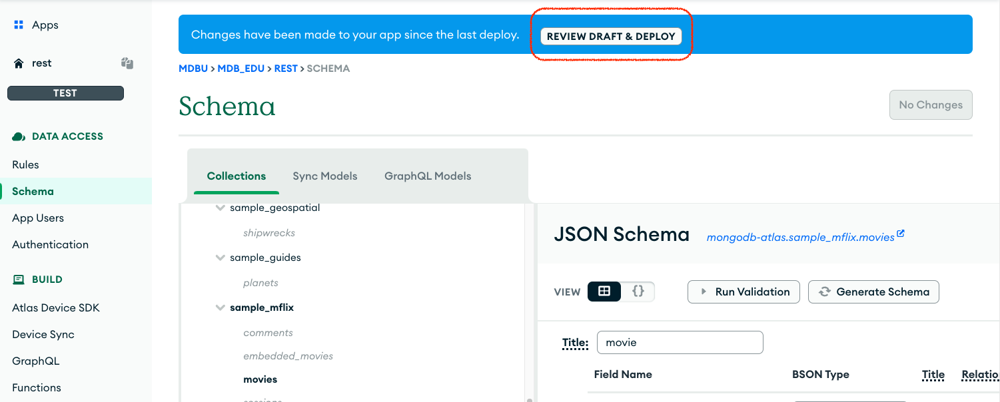
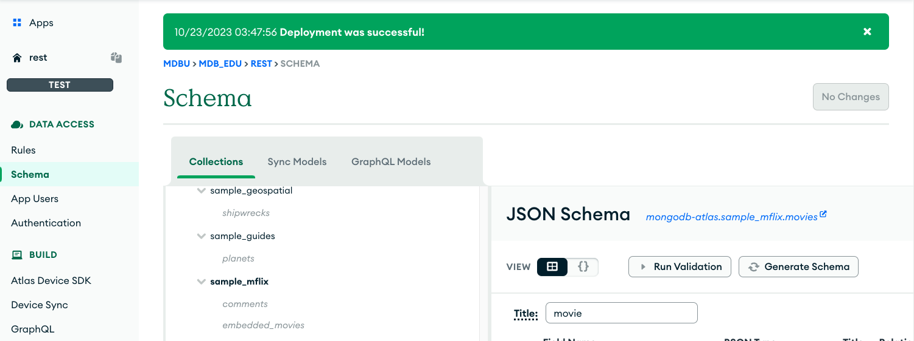
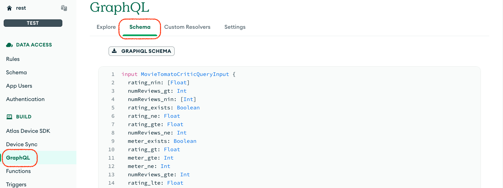
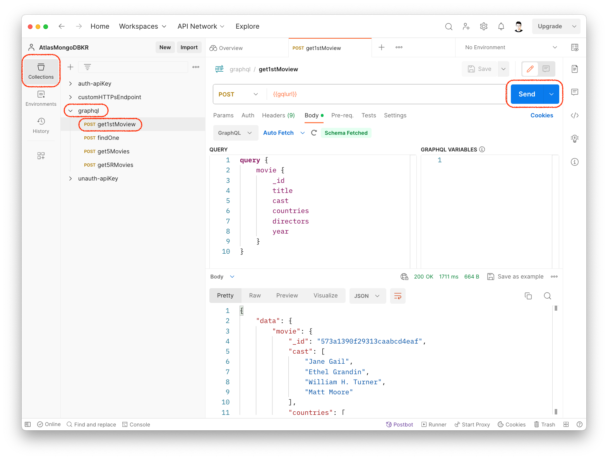

 <br>

# GraphQL

### [&rarr; Create App Service](../01.dataapi-function/README.md#create-app-service)

> Data API와 동일

### [&rarr; Set up GraphQL](#set-up-graphql)

### [&rarr; Test GraphQL](#test-graphql)

# Set up GraphQL

GraphQL query(CRUD)를 처리하려면 types, resolvers 정의가 필요하다. <br>
Atlas는 개발이 필요없이 설정을 통해 필요한 모든 데이터 구조를 자동 생성할 수 있다.

- [Schema 생성](#start-graphql-generate-schema)
- [Schema 확인](#스키마-확인)

**Types**

- data types: collection document 기반으로 자동 생성
- input types: resolver(CRUD)에서 필요한 data types
  - QueryInput
  - InsertInput
  - UpdateInput
  - RelationInput: 다른 database, collection 참조 관계 정의
  - SortByInput

**Resolvers**

- query resolvers
  - find a singlur doc
  - find multiple docs
- mutation resolvers
  - insert: singular & plural
  - update: singular & plural
  - upsert: singluar
  - replace: singular
  - delete: singular & plural

## Start GraphQL (generate schema)

직접 schema를 정의할 수도 있지만, Atlas는 기존 collection의 documents를 분석해 자동으로 schema를 생성할 수 있다.



- 상단 탭에서 `App Services` 선택 후 왼편 네비 메뉴에서 `GraphQL` 진입
- 중앙의 `Generate JSON Schema` 실행

  > 왼편 네비 메뉴에서 `Schema`를 선택 바로 진입할 수도 있음



- GarphQL 지원을 원하는 `sample_mflix.movies` collection 선택 후
- `Define a Schema` 실행



- `Generate schema from sampling` 실행



- schema 생성이 완료되면 우측 상단의 `Save Draft` 진행



- 저장 후 상단의 `REVIEW DRAFT & DEPLOY`를 클랙해 생성을 완료해야 한다
- 이 후 모달 화면 하단의 `Deploy` 클릭 후
- 아래 이미지처럼 상단에 `Deployment was successful!` 확인

> > > > 

## 스키마 확인



- 다시 `GraphQL`로 돌아가 상단의 탭의 `Schema`를 선택하면 스키마로부터 정의된 `types` 와 `resolvers`를 확인할 수 있다

<br>

eg. **movie type**

```
type Movie {
  _id: ObjectId
  awards: MovieAward
  cast: [String]
  countries: [String]
  directors: [String]
  fullplot: String
  genres: [String]
  imdb: MovieImdb
  languages: [String]
  lastupdated: String
  metacritic: Int
  num_mflix_comments: Int
  plot: String
  poster: String
  rated: String
  released: DateTime
  runtime: Int
  title: String
  tomatoes: MovieTomato
  type: String
  writers: [String]
  year: Int
}
```

<br>

eg. **query resolvers**

```
type Query {
  movie(query: MovieQueryInput): Movie
  movies(query: MovieQueryInput, limit: Int = 100, sortBy: MovieSortByInput): [Movie]!
}
```

<br>

eg. **mutation resolvers**

```
type Mutation {
  deleteManyMovies(query: MovieQueryInput): DeleteManyPayload
  deleteOneMovie(query: MovieQueryInput!): Movie
  insertManyMovies(data: [MovieInsertInput!]!): InsertManyPayload
  insertOneMovie(data: MovieInsertInput!): Movie
  replaceOneMovie(data: MovieInsertInput!, query: MovieQueryInput): Movie
  updateManyMovies(query: MovieQueryInput, set: MovieUpdateInput!): UpdateManyPayload
  updateOneMovie(query: MovieQueryInput, set: MovieUpdateInput!): Movie
  upsertOneMovie(query: MovieQueryInput, data: MovieInsertInput!): Movie
}
```

# Test GraphQL

> 테스트에 필요한 **Postman** 설정은 [[Data API Postman 셋업]](../01.dataapi-function/README.md#postman) 참조



- Workspace의 Collections에서 `graphql` collection 선택
- `get1stMoview` (Movie의 type) 선택 후 `Send` 실행
- Natural order 기준으로 collection의 첫번째 doc 확인

  > 다른 예제도 실행 확인

  > 각 예제는 정의된 query input type과 resolver param을 활용한 다양한 query 패턴을 보여준다
